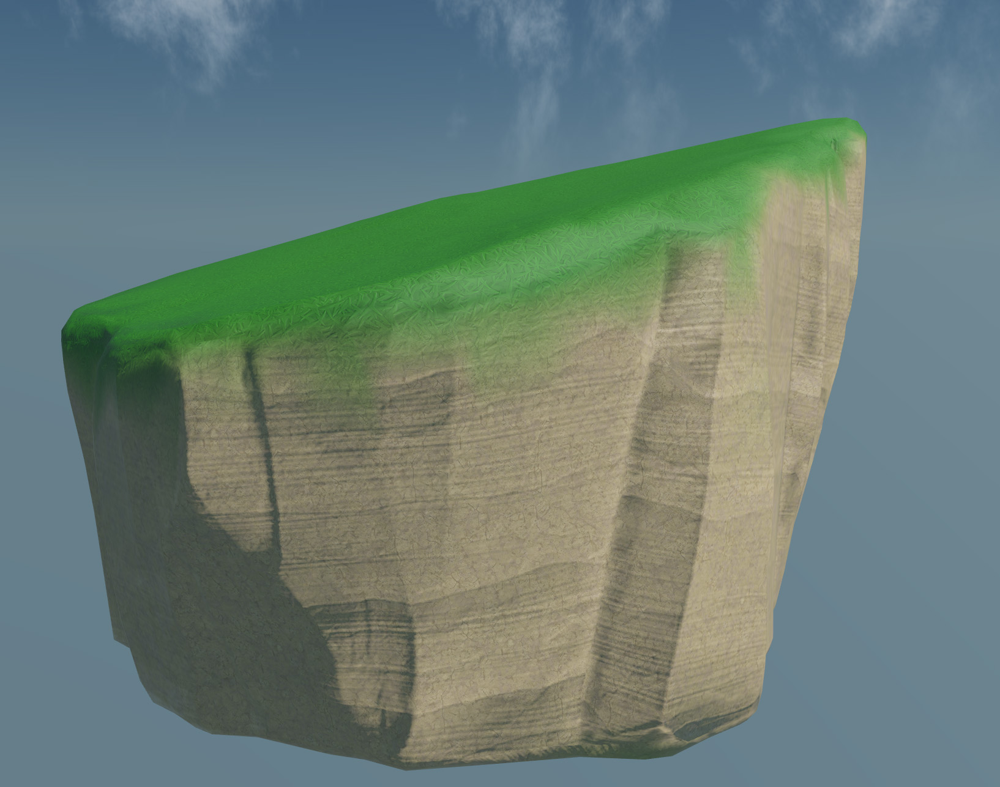
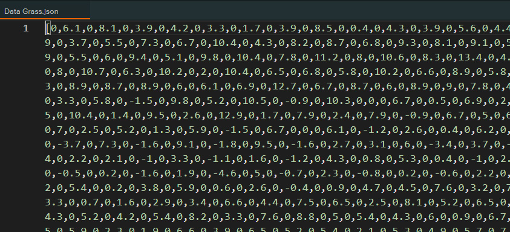

# Uranus Tools for PlayCanvas

This repository serves as the main issue tracker for the Uranus Tools for PlayCanvas.

To get access to the Uranus Tools SDK visit our website [here](https://solargames.io).

For discussion on Uranus Tools and other Solar Games products visit our public [Discord server](https://discord.gg/N7rUAFYJqX).

## Scripts List

A full alphabetical list of the scripts currently included in the Uranus Tools SDK. Documentation for each script is a work in progress coming soon.

- [Editor](#editor)
    * [uranus-editor-sdk.js](#uranus-editor-sdkjs)
- [Effects](#effects)
    * [uranus-effects-environment-fog.js](#uranus-effects-environment-fogjs)    
    * [uranus-effects-material-distance-fade.js](#uranus-effects-material-distance-fadejs)
    * [uranus-effects-material-surface-color.js](#uranus-effects-material-surface-colorjs)
    * [uranus-effects-material-wind.js](#uranus-effects-material-windjs)
    * [uranus-effects-multi-material.js](#uranus-effects-multi-materialjs)
    * [uranus-effects-render-surface.js](#uranus-effects-render-surfacejs)
    * [uranus-effects-shadows-timer.js (EXPERIMENTAL)](#uranus-effects-shadows-timerjs-experimental)
    * [uranus-effects-skybox.js](#uranus-effects-skyboxjs)
    * [uranus-effects-water.js](#uranus-effects-waterjs)
- [Instancer](#instancer)
    * [uranus-instancer-cell.js](#uranus-instancer-celljs)
    * [uranus-instancer-data.js](#uranus-instancer-datajs)
    * [uranus-instancer-lod.js](#uranus-instancer-lodjs)
    * [uranus-instancer-paint.js  (EXPERIMENTAL)](#uranus-instancer-paintjs-experimental)
    * [uranus-instancer.js](#uranus-instancerjs)
- [Physics](#physics)
    * [uranus-physics-collider.js](#uranus-physics-colliderjs)
- [Terrain](#terrain)
    * [uranus-terrain-distributor.js](#uranus-terrain-distributorjs)
    * [uranus-terrain-texture.js](#uranus-terrain-texturejs)
    * [uranus-terrain.js](#uranus-terrainjs)
    * [uranus-terrain.worker.js](#uranus-terrainworkerjs)
- [Utilities](#utilities)
    * [uranus-instantiate-template.js](#uranus-instantiate-templatejs)
    * [uranus-layer-resolution.js (DEPRECATED)](#uranus-layer-resolutionjs-deprecated)
    * [uranus-utilities.js](#uranus-utilitiesjs)
    * [uranus-worker-polyfill.js](#uranus-worker-polyfilljs)

### Editor

#### uranus-editor-sdk.js

A battle tested solution to enable editor scripting for any PlayCanvas script.

- Add editor scripting code support to existing PlayCanvas scripts by simple including an `inEditor` attribute.
- Special script hooks for editor actions (`editorInitialize`, `editorAttrChange`, `editorScriptPanelRender`).
- Easily add editor facing UI using HTML to any script instance.
- Automatic pc.Application update loop that can be paused at any instant.
- Support for physics execution in editor.

### Effects

#### uranus-effects-environment-fog.js

An upgraded global fog effect that can sample the horizon color and add height based volumetric-like fog.

#### uranus-effects-material-distance-fade.js

Smoothly fade in or out any material after a certain distance from the active camera. Works great for vegetation to smoothly fade out the grid cells of the last LOD or for buildings that use a proxy hierarchical LOD.

#### uranus-effects-material-surface-color.js

Add a surface color tint to any material. The surface color is being rendered to a texture so it can include any layers of your choice e.g. terrain, rocks etc. Works great for grass and low vegetation to make it visually integrated to the terrain.

Supports adding any number of optional animated noise channels that can simulate effects like clouds shadows.

#### uranus-effects-material-wind.js

Easily add wind like animations to any model using a powerful additive layers system. Works great with vegetation! It also supports object interaction.

#### uranus-effects-multi-material.js

A powerful extended material that allows you to blend multiple textures on the same model based either on painted vertex colors or provided texture masks. It currenty supports diffuse and normal maps, together with specular parameters.

#### uranus-effects-render-surface.js

A helper effect utility that can render a top down surface map of any object. It's being used both by other effects (material surface color) and by the terrain distributors to find the right pixel color for placement.

#### uranus-effects-shadows-timer.js (EXPERIMENTAL)

Overrides the internal PlayCanvas shadow renderer to customize how often each shadow cascade updates. Easily increase performance and reduce draw calls by reducing the update cycle of distant shadows. Works for PCF shadows only.

#### uranus-effects-skybox.js

A dynamic skybox that features a 24 hours cycle with a sun, moon and stars and procedural 2D clouds. A dynamic skybox that features a 24 hours cycle with a sun, moon and stars and procedural 2D clouds.

#### uranus-effects-water.js

A water effect that features dynamic sky reflections, depth based water color and shore foam and transparency effects. The water shader overrides the standard PlayCanvas material, supports all channels and material settings.

### Instancer

#### uranus-instancer-cell.js

Uranus Instancer can partition your entities in a grid, that you can size, and do frustum culling per cell instead of per entity. That increases performance and allows the rendering of a large number of instances.

#### uranus-instancer-data.js

When painting large number of objects like grass, to improve performance and decrease the app loading time, the instancer can spawn instances directly from a serialized .json data file.

This data file can include the full transformation info (position, rotation, scale) or omit part of them and choose random or psuedo-random (seeded) values on runtime.

#### uranus-instancer-lod.js

When using the PlayCanvas instancer level of details are automatically supported. Your models can include easy to use suffixes at their node names e.g. `_LOD2`, and the instancer will automatically show/hide the correct version based on the distance from the active camera.

You can set both global LOD distance levels, and optional local, per model, levels using this script.

#### uranus-instancer-paint.js (EXPERIMENTAL)

A powerful editor script to easily paint large numbers of entities in your PlayCanvas projects. Click and drag on any rigid body surface (including on Uranus Terrains) to paint one or more entities in place.

It can either spawn entities in place or save them in a `uranus-instancer-data.js` powered .json file. This way you can paint large numbers of objects e.g. grass with a few brush strokes.

#### uranus-instancer.js

A plug and play hardware instancing solution that can easily reduce the draw calls in any PlayCanvas project to the minimum required.

GPU instancing automatically groups all models by their mesh and material to reduce the number of draw calls rendered to the minimum.

### Physics

#### uranus-physics-collider.js

A helper utility script that provides control over the the trimesh colliders cache. It allows grouping your colliders by scale to allow for reusing memory expensive trimesh colliders.

It also extends the internal Ammo.js available shapes with a `Heightfield` shape which can be used with any Uranus Terrain.

### Terrain

#### uranus-terrain-distributor.js

A powerful object distributor that can procedurally spawn entities and objects on the terrain is provided.

Using a fast BVH raycasting solution it can accurately spawn huge number of objects on your terrain. Works in a web worker.

#### uranus-terrain-texture.js

A dynamic layered based material system to texture any terrain based on elevation and slope. Support for diffuse & diffuse with tint, normal and an optional noise texture is provided.

#### uranus-terrain.js

A fast and extensible solution to get procedurally generated terrains in PlayCanvas. A vast number of properties to fully control your terrain look. You can easily generate mountains, lakes and islands. Control the terrain size and complexity. Works in a web worker.

The Uranus Terrain Generator uses a special library to reduce the number of triangles rendered (RTIN terrain mesh generation) for each LOD.

#### uranus-terrain.worker.js

Web worker script used by `uranus-terrain.js` and `uranus-terrain-distributor.js`.

### Utilities

#### uranus-instantiate-template.js

A simple script that can instantiate an entity from a template on runtime, works both in editor and on runtime. Mainly used to avoid keeping big template instances in the scene hierarchy and reduce the application size.

#### uranus-layer-resolution.js (DEPRECATED)

A legacy script that was used to have a scene layer render to a lower resolution and increase performance. It was deprecated due to changes in the PlayCanvas engine and will be replaced in the future.

#### uranus-utilities.js

Utility methods used by the rest of the library.

#### uranus-worker-polyfill.js

Extracted objects from the PlayCanvas engine made available to the web worker, to avoid loading the full PlayCanvas engine library.